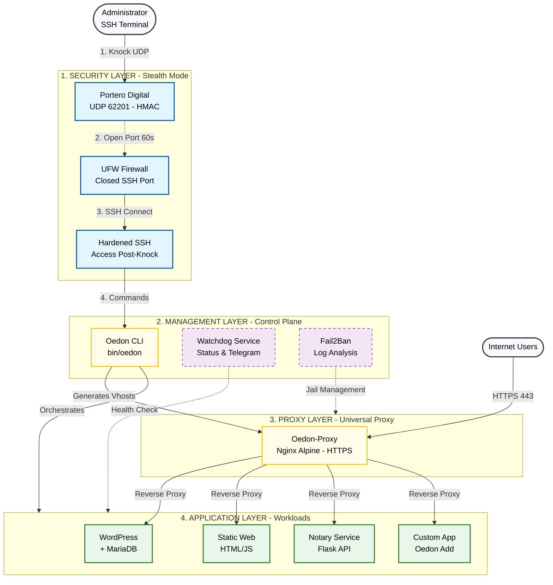
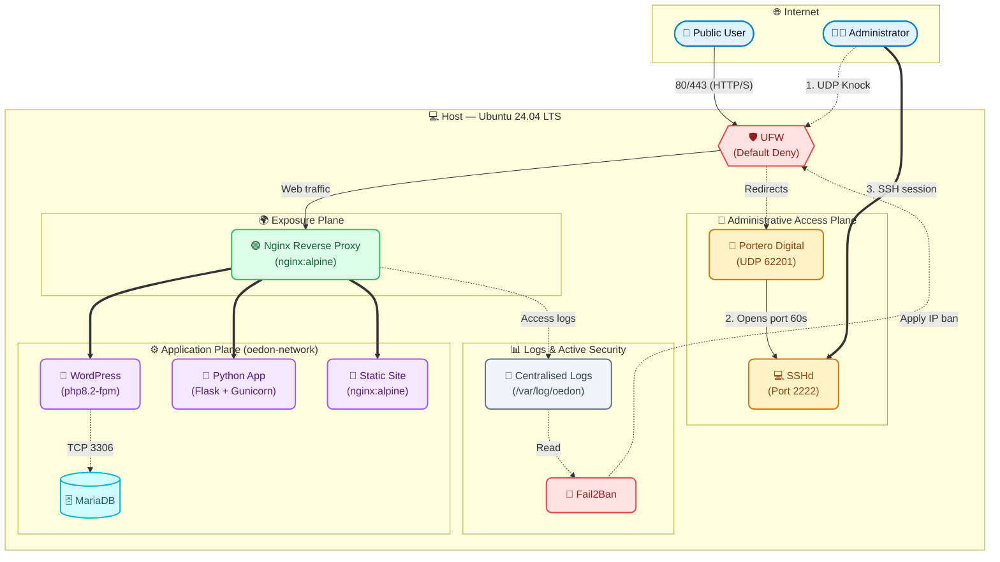
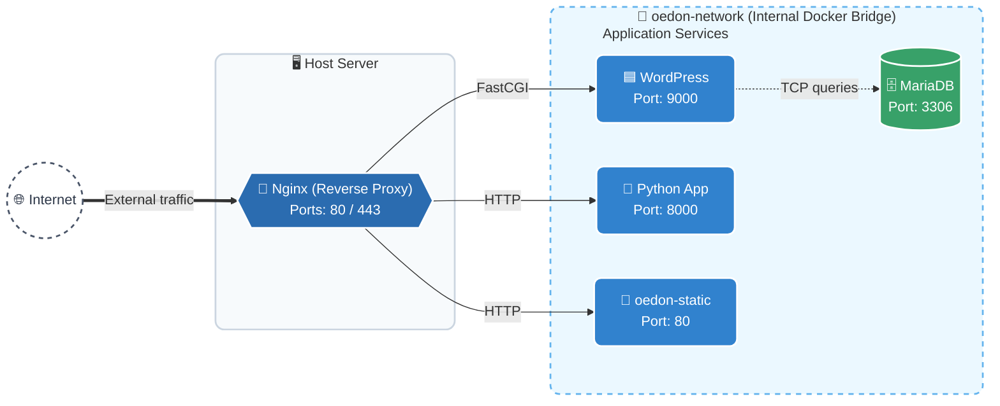
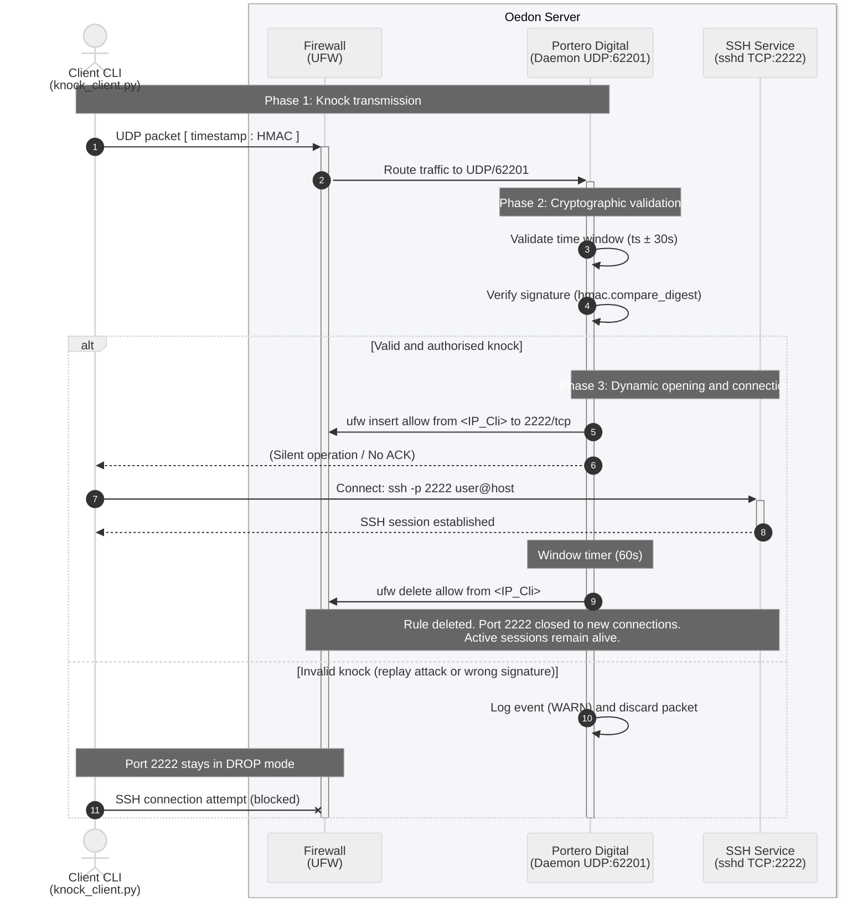
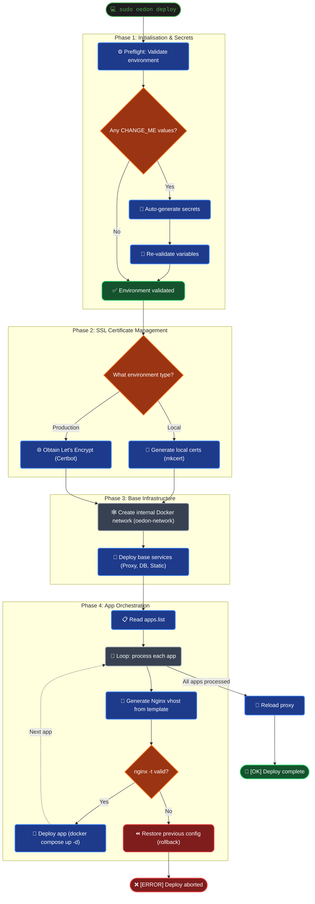
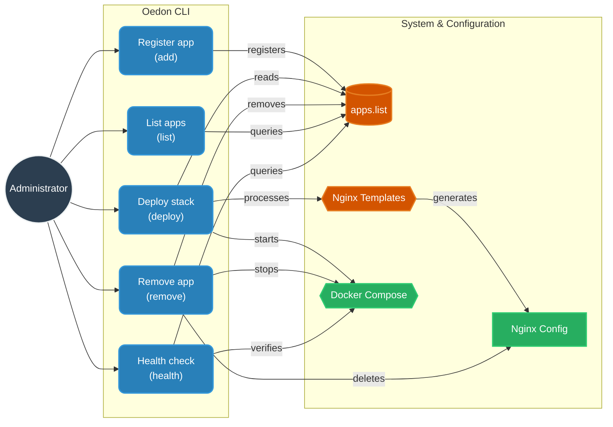
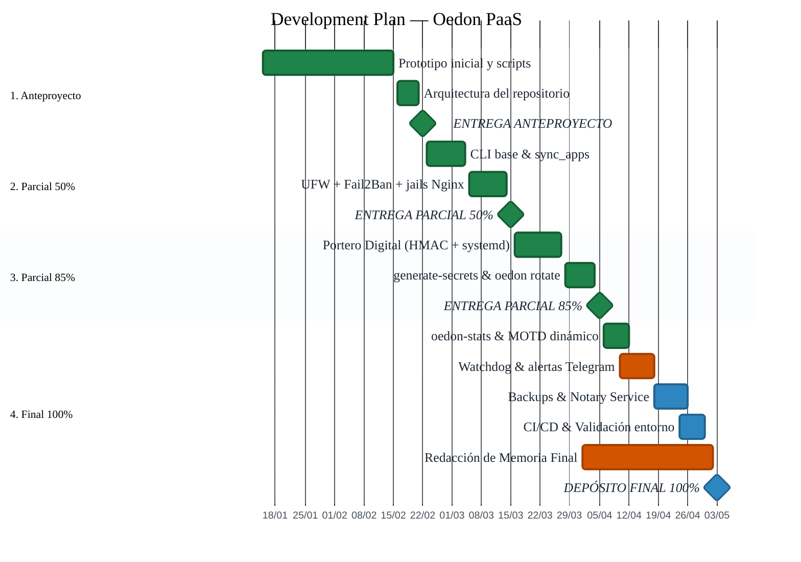

# Oedon PaaS

> **The Invisible PaaS Control Plane**

Oedon is a lightweight, terminal‑first, self‑hosted platform for deploying and managing containerized applications on modest hardware — a Raspberry Pi, a recycled PC, a cheap VPS.

It uses pure Nginx Alpine, Docker, and a custom CLI to deliver a secure, portable, and zero‑maintenance infrastructure stack. Everything runs from the terminal. No web dashboards, no configuration databases, no management layers that need updating.

The system follows the **KISS** principle: no code monoliths, only simple, optimized, and useful scripts and templates. The entire server state lives in one `.env` file and one `apps.list` — both plain text, both versionable.

> *The name Oedon comes from Bloodborne — a Great One that is formless and invisible, yet omnipresent. Oedon follows the same ideal: invisible in process lists, minimal resource consumption, maximum efficiency, and omnipresent protection for every deployed application.*

---

## Why Oedon Was Built

- **To replace heavy tools** like Nginx Proxy Manager and Netdata that require logins, add complexity, and hide errors behind GUIs.
- **To provide real infrastructure control** — you see exactly why a container failed by copying a log, not by clicking a "Health" button.
- **To eliminate hard‑coded values, monoliths, and unnecessary dependencies.**
- **To be portable** — clone the repository to any Linux server, run two commands, and have a fortified server with working HTTPS, SSH stealth, automatic backups, and self‑healing.
- **To keep the workflow inside the terminal**, where logs are grep-able, errors are copy-pasteable, and nothing needs a browser to fix.

---

## Architecture

### System overview



### Network topology



### Internal Docker network



---

## Core Features

| Area | Feature | Implementation |
|------|---------|----------------|
| **CLI** | Single command to manage everything | `oedon` — installed globally in `/usr/local/bin` |
| **Registry** | Declarative app list | `apps.list` (`name \| port \| subdomain`) |
| **Nginx** | Template‑based, no hardcoded domains | `envsubst` + templates in `config/nginx/templates/` |
| **Deployment** | Automatic proxy config & container start | `oedon deploy` reads `apps.list`, generates configs, starts containers |
| **Rollback** | If `nginx -t` fails, previous config is restored | Implemented in `sync_apps.sh` |
| **SSL** | Local: `mkcert` — Production: Certbot container | `oedon deploy` detects `APP_ENV` and handles both |
| **Port Knocking** | Custom UDP HMAC‑SHA256 knock server | `internal/portero/portero.py` + systemd service |
| **Firewall** | UFW default deny — open: 80/tcp, 443/tcp, 62201/udp | `05-setup-firewall.sh` |
| **Fail2Ban** | Nginx jails for auth failures, bot scanning, bad agents | `06-setup-fail2ban.sh` |
| **Monitoring** | Terminal dashboard + MOTD on SSH login | `oedon-stats.sh`, `btop` |
| **Watchdog** | Disk, memory, container checks every 5 min + Telegram alerts | `oedon-watchdog.sh` + cron |
| **Backups** | Database dump + infrastructure archive → Telegram | `99-backup.sh` |
| **Notary** | Integrity verification and signing for deployments | Python‑Flask container with persistent JSON registry |
| **Logs** | Centralised real‑time streaming | `oedon monitor` |

---

## Security Model

| Layer | Mechanism |
|-------|-----------|
| **Firewall** | Default deny. Only HTTP(S) and Portero UDP are open to the public. |
| **SSH** | Port completely closed. Opened for 60 seconds only after a valid UDP knock. |
| **Port Knocking** | `portero.py` listens on UDP 62201. HMAC‑SHA256 signed timestamp — replay attacks impossible. |
| **Fail2Ban** | Bans IPs scanning for `.env`, `.git`, wp‑login, or using malicious user agents. |
| **Nginx** | `server_tokens off` — version hidden from headers. |
| **Docker** | All containers isolated on a user‑defined bridge (`oedon-network`). No container exposes ports to the host except the proxy. |
| **Secrets** | Auto‑generated with `generate-secrets.sh` — never committed. `.gitignore` excludes `.env`, SSL keys, and data. |

> **Why not fwknop?**
> Oedon implements its own lightweight SPA (Single Packet Authorization) using HMAC + timestamps. It's replay‑proof, leaves no log noise, requires no compilation, and runs as a plain Python systemd service with zero external dependencies.

### Portero Digital — knock sequence



---

## Quick Start

### 1 — Clone and install

```bash
git clone --depth=1 https://github.com/MohamedKamil-hub/Oedon
cd Oedon
sudo bash install.sh
```

`install.sh` does the following automatically:

- Creates `.env` from `.env.example`
- Installs Docker Engine, Fail2Ban, UFW, `mkcert`
- Registers the `oedon` CLI globally in `/usr/local/bin`
- Sets up the watchdog cron job (every 5 minutes)
- Configures Portero Digital as a systemd service
- Prepares log directories under `/var/log/oedon`

### 2 — Deploy

```bash
sudo oedon deploy
```

On first run, the preflight validator checks `.env` for any `CHANGE_ME` values and interactively asks for the ones that need human input (domain, email). Everything else is auto‑generated.

```
sudo bash install.sh     # creates .env template, installs deps
sudo oedon deploy         # preflight finds CHANGE_ME →
                          #   asks "Configure now? (Y/n)" →
                          #   DOMAIN: prompts user
                          #   secrets: auto-generated
                          #   defaults: applied silently
                          #   → deploys
```

After a successful deploy, your sites are live at:

```
https://static.<your-domain>
https://wordpress.<your-domain>
https://python.<your-domain>
```

### Deploy flow



---

## CLI Reference

### App management



### Full command table

| Command | Description |
|---------|-------------|
| `oedon deploy` | Full deployment — sync registry, generate configs, start all apps |
| `oedon add <name> <port> <subdomain>` | Register a new app (`oedon add moodle 8080 lms`) |
| `oedon remove <name>` | Unregister, stop container, remove Nginx config |
| `oedon list` | Show all apps registered in `apps.list` |
| `oedon sync` | Regenerate Nginx configs from `apps.list` and reload (with rollback) |
| `oedon health` | HTTP health check for each registered app |
| `oedon status` | Docker container status via `docker compose ps` |
| `oedon logs <container>` | Follow logs of a specific container |
| `oedon monitor` | Stream all container logs + Nginx simultaneously |
| `oedon stats` | Terminal dashboard (CPU, RAM, disk, Docker, SSH failures, sites) |
| `oedon up / down / restart` | Control the core infrastructure stack |
| `oedon lockdown` | Enable stealth mode — close SSH port, start Portero, generate `knock_client.py` |
| `oedon secure` | Apply UFW firewall and Fail2Ban hardening |
| `oedon backup` | Dump database + compress infra → send to Telegram |
| `oedon watchdog-test` | Manually trigger the self‑healing watchdog check |
| `oedon janitor` | Clean Docker build cache, dangling images, and system logs |
| `oedon reset` | Stop all containers, remove generated configs, optionally wipe `.env` |
| `oedon rotate` | Interactive secret rotation wizard |
| `oedon certs` | SSL certificate management (mkcert local / Certbot production) |

---

## Adding a Custom App

Oedon can proxy any application that runs in Docker. The only requirements are that the container is attached to `oedon-network` and that its `container_name` matches the name you register.

### Example: Moodle

**Step 1 — Create the app directory**

```bash
mkdir -p apps/moodle
```

**Step 2 — Write a `docker-compose.yml`**

```yaml
# apps/moodle-app/docker-compose.yml
services:
  moodle-db:
    image: mariadb:10.11
    command: --character-set-server=utf8mb4 --collation-server=utf8mb4_unicode_ci
    environment:
      MYSQL_DATABASE: moodle
      MYSQL_USER: moodleuser
      MYSQL_PASSWORD: moodlepass
      MYSQL_ROOT_PASSWORD: rootpass
    networks:
      - oedon-network

  moodle:
    image: public.ecr.aws/bitnami/moodle:latest
    container_name: moodle          # Must match the name in `oedon add`
    depends_on:
      - moodle-db
    environment:
      MOODLE_DATABASE_HOST: moodle-db
      MOODLE_DATABASE_USER: moodleuser
      MOODLE_DATABASE_PASSWORD: moodlepass
      MOODLE_DATABASE_NAME: moodle
      MOODLE_REVERSE_PROXY: "yes"
    networks:
      - oedon-network

networks:
  oedon-network:
    external: true
```

**Step 3 — Register the app**

```bash
sudo oedon add moodle 8080 lms
# Adds: moodle | 8080 | lms  →  to apps.list
```

**Step 4 — Deploy**

```bash
sudo oedon deploy
# Generates: config/nginx/sites-enabled/moodle.conf
# Starts:    apps/moodle-app via docker compose up -d
# Reloads:   oedon-proxy
```

Your Moodle is now at `https://lms.<your-domain>`.

---

## Stealth SSH Access (Portero Digital)

Portero is Oedon's built‑in UDP port knocking daemon. It keeps your SSH port invisible to public scanners until a valid HMAC‑SHA256 signed packet is received.

### Activate

```bash
sudo oedon lockdown
```

This will:
- Start `oedon-portero.service` via systemd
- Open UDP port `62201` in UFW
- **Close** the SSH TCP port
- Generate a pre-configured `knock_client.py` with your secret embedded

### Connect

Copy `knock_client.py` to your local machine, then:

```bash
# Open the SSH port for your IP (60-second window)
python3 knock_client.py <server_ip>

# Connect normally
ssh -p 2222 user@<server_ip>
```

The knock payload is `timestamp:HMAC-SHA256(secret, timestamp)`. Any packet older than 30 seconds is rejected, making replay attacks impossible regardless of traffic interception.

---

## Monitoring & Maintenance

**On every SSH login**, your MOTD shows the live state of the server:

```
 HOST     myserver  │  Ubuntu 24.04  │  6.8.0-107-generic
 UPTIME   10 hours, 55 minutes  │  Load: 0.00 0.00 0.00
────────────────────────────────────────────────────────────
 CPU      Intel Core i7 (2 cores)
          ██░░░░░░░░░░░░░░░░░░░░░░░░░░░░   5.3%
 MEMORY   721/3866 MB
          ██████░░░░░░░░░░░░░░░░░░░░░░░░  18.6%
────────────────────────────────────────────────────────────
 DOCKER   5 running / 5 total
 SSH      0 failed login attempts (last 24h)
 SITES
  🌐 https://static.myserver.local
  🌐 https://wordpress.myserver.local
  🌐 https://python.myserver.local
```

| Tool | What it does |
|------|-------------|
| `oedon stats` | Terminal dashboard: CPU, RAM, disk, Docker state, SSH failures, registered sites |
| `oedon monitor` | Real‑time multiplexed log stream from all containers + Nginx |
| `btop` | Interactive resource monitor (installed automatically) |
| **Watchdog** | Cron every 5 min — checks disk >85%, memory >90%, container state. Auto-restarts downed containers. Sends Telegram alert with 30‑min cooldown. |
| `oedon backup` | Dumps MariaDB, compresses the project (excluding logs/data), sends both to Telegram via `sendDocument`. |

> No web dashboards. Everything is in the terminal — errors are copy‑pasteable, logs are grep‑able, and there is nothing to update or reboot in the management layer.

---

## Integrity Verification (Notary Service)

The `python-app` container runs a small Flask service that acts as a deployment notary.

```
GET  /verify?app=<name>&hash=<hash>   →  VERIFIED | COMPROMISED | NOT_FOUND
POST /sign  (X-Oedon-Key: <key>)      →  registers a new hash for an app
```

Use it to verify that code running on the server hasn't been tampered with since the last authorised deployment. If a file was modified outside of a signed deploy, the next verification returns `COMPROMISED`.

---

## Declarative Configuration

All state is in plain text. These two files are the source of truth for your server:

**`.env`** — all variables, never committed:
```bash
DOMAIN=myserver.com
APP_ENV=production          # local | production
PORTERO_SECRET=<generated>
PORTERO_UDP_PORT=62201
PORTERO_WINDOW=60
PORTERO_TOLERANCE=30
MYSQL_ROOT_PASSWORD=<generated>
MYSQL_PASSWORD=<generated>
WATCHDOG_DISK_THRESHOLD=85
WATCHDOG_MEM_THRESHOLD=90
TELEGRAM_TOKEN=             # optional
TELEGRAM_CHAT_ID=           # optional
```

**`apps.list`** — your application registry:
```
# name             | internal port | subdomain
oedon-static       | 80            | static
wordpress          | 9000          | wordpress
python-app         | 5000          | python

# Uncomment to deploy:
# moodle           | 8080          | lms
# gitea            | 3000          | git
```

---

## Development Timeline



---

## Roadmap

```mermaid
flowchart TD
    classDef phase fill:#2C3E50,color:#ECF0F1,stroke:#34495E,stroke-width:2px,rx:5,ry:5,font-weight:bold,font-size:16px
    classDef task fill:#F8F9FA,color:#2C3E50,stroke:#BDC3C7,stroke-width:2px,rx:8,ry:8,text-align:left
    classDef title fill:#005B96,color:#FFFFFF,stroke:#03396C,stroke-width:2px,rx:10,ry:10,font-weight:bold,font-size:18px

    T{{"🚀 OEDON — EVOLUTION ROADMAP"}}:::title

    P1["Phase 1: Short Term (1 - 3 months)"]:::phase
    P2["Phase 2: Medium Term (3 - 9 months)"]:::phase
    P3["Phase 3: Long Term (9+ months)"]:::phase

    T1_1["<b>Automatic Certbot renewal</b><br/><i>Weekly cron + Telegram notification</i>"]:::task
    T1_2["<b>Kernel hardening (sysctl)</b><br/><i>oedon secure extended with kernel parameters</i>"]:::task
    T1_3["<b>Advanced log filtering</b><br/><i>oedon logs --tail N --grep PATTERN --all</i>"]:::task

    T2_1["<b>SSH Honeypot (Cowrie)</b><br/><i>Port 22 as decoy, Fail2Ban integration</i>"]:::task
    T2_2["<b>Stack auto-update</b><br/><i>oedon update to refresh Docker images safely</i>"]:::task
    T2_3["<b>Structured logs</b><br/><i>JSON logging + configurable retention</i>"]:::task

    T3_1["<b>Multi-node architecture</b><br/><i>Distributed roles: Gateway / Worker / Data</i>"]:::task
    T3_2["<b>Remote deployment</b><br/><i>oedon deploy --node &lt;name&gt;</i>"]:::task
    T3_3["<b>Optional TUI interface</b><br/><i>ncurses dashboard — no web dependencies</i>"]:::task

    T --> P1
    P1 --- T1_1 --- T1_2 --- T1_3

    T1_3 --> P2
    P2 --- T2_1 --- T2_2 --- T2_3

    T2_3 --> P3
    P3 --- T3_1 --- T3_2 --- T3_3
```



---

## Repository Structure

```
Oedon/
├── apps/                    # One directory per deployed application
│   ├── python-app/          # Notary service (Flask)
│   ├── static-web/          # Default static site
│   └── wordpress/           # WordPress + MariaDB
├── bin/
│   └── oedon                # Main CLI dispatcher
├── config/
│   ├── nginx/
│   │   ├── nginx.conf       # Base Nginx config
│   │   ├── sites-enabled/   # Generated vhosts (gitignored)
│   │   ├── ssl/             # SSL certificates (gitignored)
│   │   └── templates/       # envsubst templates per app type
│   ├── fail2ban/            # Custom jails and filters
│   └── ssh/                 # Hardened sshd_config + server key
├── internal/
│   └── portero/             # Portero Digital daemon + systemd service
├── scripts/                 # One script per responsibility
│   ├── deploy.sh
│   ├── sync_apps.sh         # Generates Nginx configs with rollback
│   ├── oedon-watchdog.sh    # Self-healing + Telegram alerts
│   ├── oedon-stats.sh       # Terminal dashboard
│   ├── generate-secrets.sh  # Secret provisioning and rotation
│   └── ...
├── tools/
│   └── knock/               # Knock client for local machines
├── apps.list                # Declarative application registry
├── docker-compose.yml       # Core infrastructure stack
├── .env.example             # Configuration template
└── install.sh               # Bootstrap installer
```

---

## License

MIT — © 2026 Mohamed Kamil.

Free to use, modify, and distribute. See `LICENSE` for details.

---

**Oedon is designed for systems administrators who want full control, maximum security, and a workflow that stays inside the terminal.**
Simple, optimized, and useful — exactly as intended.
