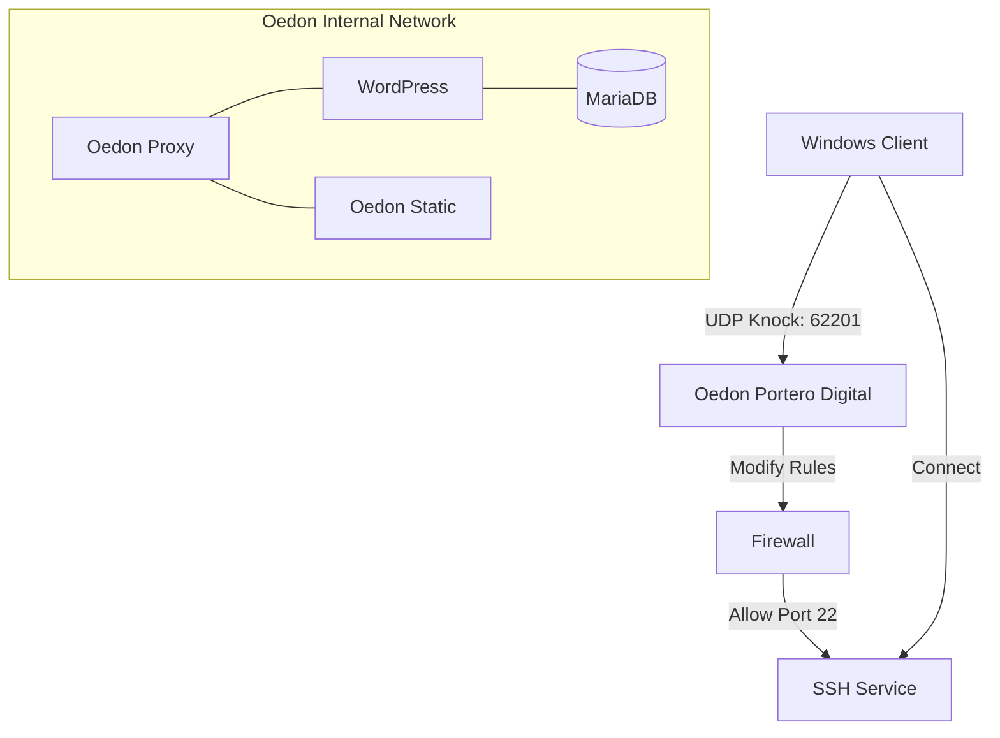

# Oedon PaaS

The Invisible PaaS Control Plane. Oedon is a lightweight, declarative deployment engine designed to manage Docker containers behind an automated Nginx proxy, fortified with an internal stealth security system.

## 1. Installation (The Bootstrap)

Run a single script to prepare your server environment. This process automatically installs Docker, secures the server with Fail2ban and UFW, configures the digital port-knocker (Portero), and registers the `oedon` CLI command globally.

```bash
git clone [https://github.com/MohamedKamil-hub/Oedon.git](https://github.com/MohamedKamil-hub/Oedon.git)
cd Oedon
sudo bash install.sh
```




## 2. Default Deployment

Oedon comes pre-configured with three base environments out of the box:
* **Static Web** (`oedon-static` on port 80)
* **Python Application** (`python-app` on port 5000)
* **WordPress** (`wordpress-app` on port 9000)

To spin up the core infrastructure proxy and these default applications, simply run:

```bash
sudo oedon deploy
```

## 3. Adding Custom Services (Moodle Example)

Oedon allows you to deploy complex applications alongside your default stack without touching the core Nginx configuration. Here is how to deploy Moodle as a new service.

### Step 3.1: Create the Application Directory
Create a dedicated folder for your application inside the `apps/` directory.

```bash
mkdir -p apps/moodle-app
```

### Step 3.2: Define the Infrastructure
Create a `docker-compose.yml` file inside the new folder. 

> **Crucial Requirement:** All services must be attached to the `oedon-network`, and the `container_name` of the web service must exactly match the name you use when registering the app.

**File: `apps/moodle-app/docker-compose.yml`**
```yaml
services:
  moodle-db:
    image: mariadb:10.11
    command: --character-set-server=utf8mb4 --collation-server=utf8mb4_unicode_ci
    environment:
      - MYSQL_DATABASE=moodle
      - MYSQL_USER=moodleuser
      - MYSQL_PASSWORD=moodlepass
      - MYSQL_ROOT_PASSWORD=rootpass
    networks:
      - oedon-network

  moodle:
    image: public.ecr.aws/bitnami/moodle:latest
    container_name: moodle
    depends_on:
      - moodle-db
    environment:
      - MOODLE_DATABASE_HOST=moodle-db
      - MOODLE_DATABASE_USER=moodleuser
      - MOODLE_DATABASE_PASSWORD=moodlepass
      - MOODLE_DATABASE_NAME=moodle
      - MOODLE_REVERSE_PROXY=yes
    networks:
      - oedon-network

networks:
  oedon-network:
    external: true
```

### Step 3.3: Register the Application
Use the Oedon CLI to declare the app, map its internal port (8080 is standard for Bitnami containers), and assign its domain. This updates the declarative `apps.list` registry.

```bash
sudo oedon add moodle 8080 lms.oedon.test
```

### Step 3.4: Launch
Run the master deploy command. Oedon will read the registry, generate the Nginx proxy configurations, handle SSL certificates, and start the new containers.

```bash
sudo oedon deploy
```

## 4. Stealth Security (Portero Digital)

Oedon includes an internal HMAC-based port-knocking system to hide your management ports (like SSH) from public scanners and bots.

### Server Lockdown
The core logic resides in `internal/portero/`. When you are ready to blind the server to the public, run the secure command. This links the Portero service to your OS and closes the public SSH port via UFW.

```bash
sudo oedon secure
```

### Client Access
To access your server once it is locked down, use the client tools located in `tools/knock/`.

1. Copy the `tools/knock/` directory and your server's `.env` file to your local machine.
2. Run the knock script to securely open the port for a brief window:
   ```bash
   python3 knock.py <server_ip>
   ```
3. Access your server via SSH normally.
```
sudo bash install.sh     # copies .env template, installs deps
sudo oedon deploy         # preflight finds CHANGE_ME ->
                          #   asks "Configure now? (Y/n)" ->
                          #   DOMAIN: prompts user
                          #   secrets: auto-generated
                          #   defaults: applied silently
                          #   -> deploys
